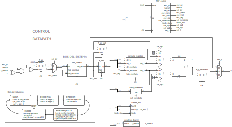

# Proyecto Integrador Electrónica II - Núcleo Risc-V

Electrónica II para Ingeniería Electrónica. 2024

## Objetivos

- Diseña, describe a nivel transferencia de registros, evalúa mediante simulación los siguientes componentes:
  - Función *cero* de 32 bit. La entrada es una señal de 32 bit y la salida una señal de un bit, que vale $1$ cuando la señal de entrada vale cero.
  - Función *AND* de dos entradas de 32 bit. Las entradas y la salida son señales de 32 bit. Cada bit de la salida es el producto lógico de los bits correspondientes de las entradas.
  - Función *OR* de dos entradas de 32 bit. Las entradas y la salida son señales de 32 bit. Cada bit de la salida es la suma lógica de los bits correspondientes de las entradas.
  - Función *XOR* de dos entradas de 32 bit. Las entradas y la salida son señales de 32 bit. Cada bit de la salida es el o exclusivo de los bits correspondientes de las entradas.
  - Función *SUMA/RESTA* de dos entradas de 32 bit. Incluye una entrada de selección, $0$ para suma y $1$ para resta, dos entradas de 32 bit y una salida de 32 bit. La salida es la suma o resta de las entradas según la entrada de selección.
  - Función *MENOR QUE* de 32 bit para valores en binario natural y con signo complemento a dos. Incluye una entrada de selección, $0$ con signo y $1$ sin signo, dos entradas, $A$ y $B$, de 32 bit y una salida de un bit. La salida es $1$ si la entrada $A$ es menor que la entrada $B$ y $0$ caso contrario. La comparación se realiza considerando valores en binario natural o en complemento a dos según indique la entrada de selección.
  - Función *desplazamiento a la izquierda* de un valor de 32 bit por la cantidad de bits indicada por un valor de 5 bit. Ingresa ceros por la derecha.
  - Función *desplazamiento a la derecha* de un valor de 32 bit por la cantidad de bits indicada por un valor de 5 bit. Cuenta con un selector de modo *con signo*. En modo sin signo ingresa ceros por la izquierda, en modo con signo copia el bit de signo (extensión de signo).
- A partir de los componentes desarrollados en el punto anterior, diseña, describe a nivel estructural y evalúa mediante simulación una unidad aritmética-lógica de 32 bit con dos entradas de operando, una entrada de selección, una salida de resultado y una salida de cero, con las funciones dadas por la Tabla 1.
- Diseña, describe a nivel comportamental y evalúa mediante simulación un registro de 32 bit con habilitación de escritura.

Tabla 1: Funciones de la ALU.

| *Sel* | *Y* | *Z* |
|:-----:|:---|:---:|
|`0000` | $A+B$ | $Y=0$ |
|`0001` | $A-B$ | $Y=0$ |
|`001-` | $A << B$ | $Y=0$ |
|`010-` | $A<B\quad$ Complemento a 2 | $Y=0$ |
|`011-` | $A<B\quad$ Binario natural | $Y=0$ |
|`1010` | $A >> B\,$ Binario natural | $Y=0$ |
|`1011` | $A >> B\,$ Complemento a 2 | $Y=0$ |
|`100-` | $A \oplus B$ | $Y=0$ |
|`110-` | $A \vee B$ | $Y=0$ |
|`111-` | $A \wedge B$ | $Y=0$ |

*Notas*:  *Sel* es la entrada de selección, de 4 bit. *A* y *B* son los operandos, de 32 bit. *Y* es el resultado, de 32 bit y *Z* es la salida de cero, de un bit. Los operadores ' $<<$ ' y ' $>>$ ' denotan desplazamiento a la izquierda y desplazamiento a la derecha respectivamente. Los operadores ' $=$ ' y ' $<$ ' denotan las operaciones relacionales *igual a* y *menor que*, que evalúan a $1$ si se cumple la condición y $0$ en caso contrario.

- Describir y evaluar mediante simulación las siguientes memorias:
  - Memoria RAM de dos puertos sincrónicos (lectura y escritura) de 256x32 bit.
  - Conjunto de registros de 32x32 bit de tres puertos sincrónicos, dos de lectura y uno de escritura. El registro cero será de solo lectura y su valor será siempre '0'.

- Describir el conjunto de registros de la arquitectura RISC-V
- Estudiar, del conjunto de instrucciones RV32I
  - Describir la estructura de las instrucciones tipo R, I, S, B, U y J.
  - Determinar como se calcula el valor inmediato para los tipos I, S, B, U y J.
  - Analizar las instrucciones de código de operación decimal 19 y 51, encontrar la manera en que se codifica la operación matemática de la ALU
  - Analizar las instrucciones de código de operación decimal 99 (saltos condicionales), determinar la forma en que se codifica la operación de la ALU y la condición de cero necesaria para tomar el salto.
- Utilizando los bloques desarrollados diseñar un datapath multiciclo que permita implementar el conjunto de instrucciones RV32I.  Diseñar los bloques de valor inmediato, control ALU y condición branch de acuerdo a lo estudiado anteriormente sobre dicho conjunto de instrucciones. Utilizar la figura 1 como referencia.
- Determinar las operaciones necesarias para la implementación en el datapath diseñado de las operaciones RV32I `lw`, `sw` y las de codigos de operación 19, 51, 99, 103 y 111.
- Diseñar una unidad de control (máquina de estado finito) capaz de ejecutar las instrucciones mencionadas en el apartado anterior.
- Realizar la descripción de hardware en Verilog de un procesador conformado por el datapath y control diseñados. La Figura 1 muestra un diagrama esquemático ilustrativo del diseño final esperado.
- Evaluar mediante simulación el desempeño del procesador desarrollado utilizando el programa de prueba del Listado 1 (dado en ensamblador y código máquina).

Listado 1: Listado del programa de prueba.

~~~ asm
dir(hex): código máquina (hex)   código ensamblador
   0:   02400293                addi    t0,zero,36
   4:   00000313                addi    t1,zero,0
   8:   00800393                addi    t2,zero,8
   c:   0100006f                jal     zero,1c
  10:   0062a023                sw      t1,0(t0)
  14:   00428293                addi    t0,t0,4
  18:   00130313                addi    t1,t1,1
  1c:   fe734ae3                blt     t1,t2,10
  20:   0000006f                jal     zero,20
~~~

Figura 1: Diagrama esquemático del diseño final esperado

## Entorno de trabajo

Este proyecto incluye un Makefile que automatiza las tareas. Requiere tener instalado make para usar el makefile; GHDL para simular descripciones en VHDL; icarus verilog para simular descripciones en verilog; yosys y netlistsvg para generar diagramas; binutils de arquitcetura riscv64-unknown-elf para compilar el programa de prueba. Por defecto el proyecto está en modo Verilog, para cambiara a vhdl usa `make modo_vhdl`. Para volver a modo verilog desde modo vhdl usa `make modo_verilog`.

Para crear archivos verilog para un nuevo módulo usar `make nuevo_<modulo>` donde `<modulo>` es el nombre del nuevo módulo. Esto creará `src/<modulo>.v` conteniendo la descripción de una compuerta and de dos entradas y `src/sim_<modulo>.v` con su simulación. Luego pueden modificarse estos archivos para contener el diseño y la simulación deseados.

Para correr la simulación de un módulo utilizar `make sim_<modulo>`. Esto compilará la simulación en `src/sim_<modulo>.v`, guardando el resultado en `build/modulo` y la ejecutará guardando la salida producida en la carpeta `resultados`.

Para sintetizar un diseño y crear el diagrama esquemático del resultado utilizar `make diagrama_<modulo>`. El esquemático resultante será guardado en `resultados/<modulo>.svg`.

Para compilar el programa de prueba y crear el archivo de contenido de memoria usar `make asm`. Luego el archivo será legible con `$readmemh("../resultados/prog_prueba.mem",<arreglo de memoria>,<dirección inicio>,<dirección fin>);`

## Entregables

Las descripciones de hardware y bancos de prueba realizados. Usar este repositorio como base y añadirlos dento del subdirectorio `src`.

Un informe con la siguiente estructura:

- *Título*
- *Autor*
- *Resumen*
- *Introducción* Presentar los conceptos de arquitectura de computadora, microarquitectura y explicar el alcance del trabajo desarrollado.
- *Desarrollo* Presentar los resultados de la investigación sobre la arquitectura RISC V y el conjunto de instrucciones RV32I.
- *Resultados* Presentar el diseño del procesador. Indicar los componentes desarrollados y sus bancos de prueba. Presenta un análisis de los resultados de simulación. Determina si el programa de ejemplo fue ejecutado correctamente.
- *Conclusiones* Explica con tus palabras los conceptos aprendidos y valora las capacidades del diseño obtenido.
- *Referencias* Debes utilizar citas bibliográficas durante el desarrollo siempre que emplees ideas tomadas de la bibliografía. Esta sección incluye las referencias bibliográficas correspondientes, en formato APA.

## Evaluación

El trabajo deberá ser defendido en una presentación oral.
